# 资产管理

---

我们可以在GEE的资产管理(Asset Manager)页面上传本地资源，或是对资源进行分享。

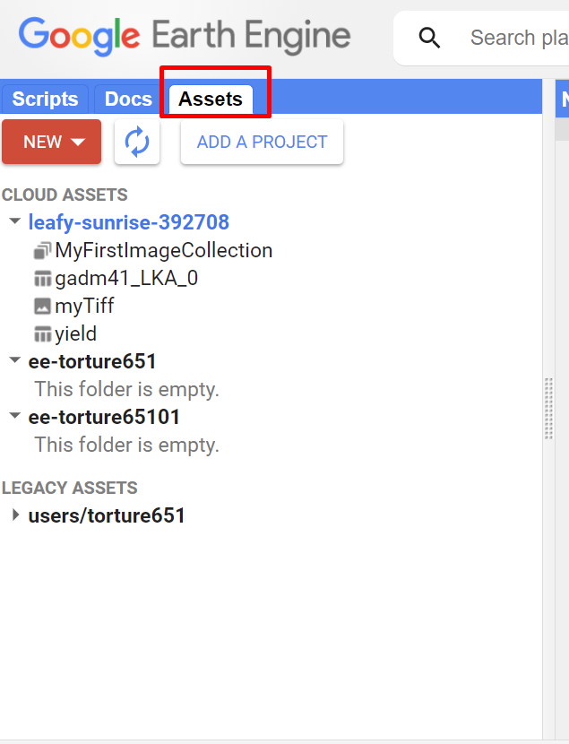

位置就在Code Edit的Assets选项栏。

每个项目都有给定空间配额，将鼠标悬停在项目名称上，即可查看可用配额。

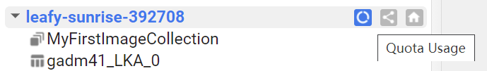

---

## 资源导入

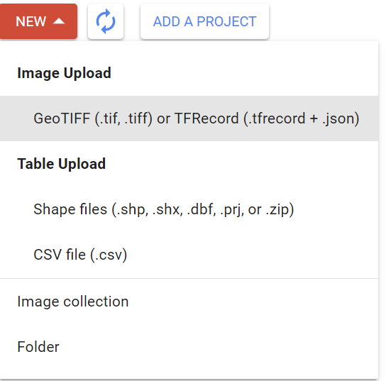

选择`New`选项，即可进行导入。可以导入图片或是表格文件，我们一个个说明。

### *文件夹*

最基础的就是导入文件夹，没有别的操作空间：

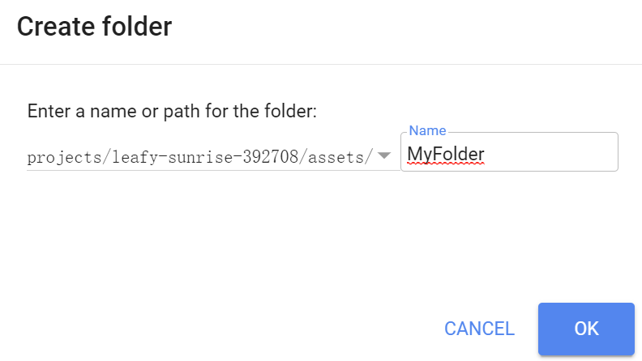

创建成功后，可以在项目名称下看到。

同样，一个`ImageCollection`也是如此创建。

---

### *CSV*

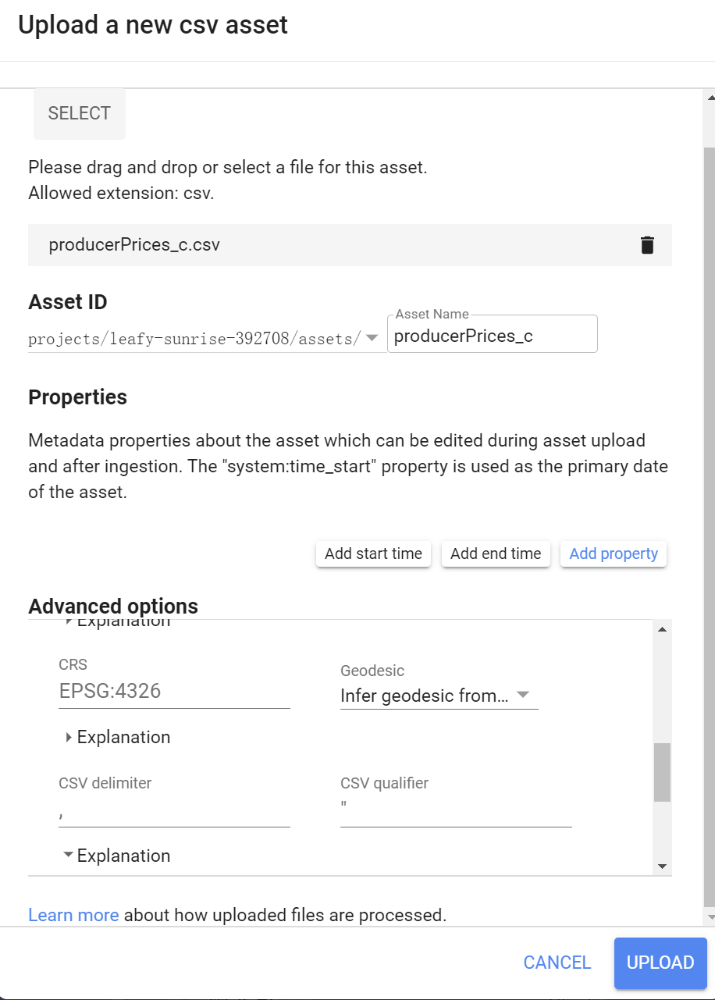

关于CSV文件导入，可以在高级选项中指定地理实体字段、指定经纬，甚至是修正分割属性。

所有的导入任务都可以在`Tasks`选项卡中找到。

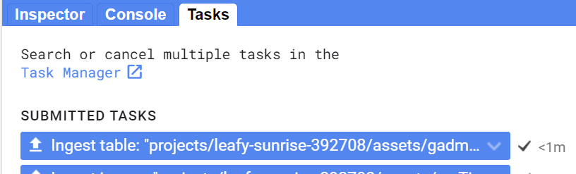

导入后，双击文件名即可查看文件细节，可以使用`MarkDown`编辑内容。

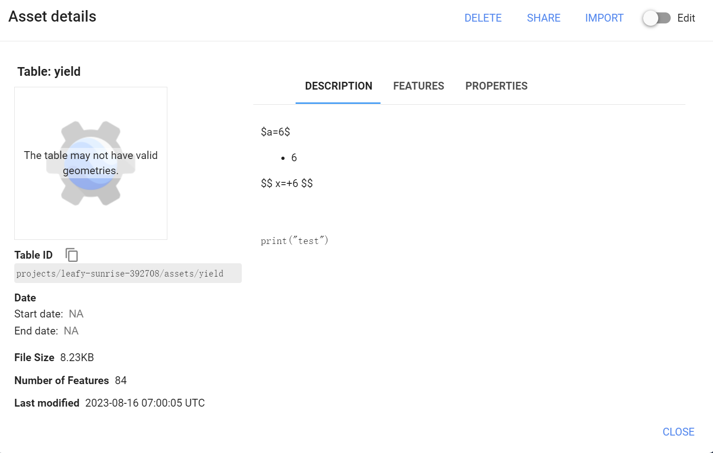

当需要导入文件时，选择`IMPORT`选项，可以自动将文件导入到`Code Edit`中：

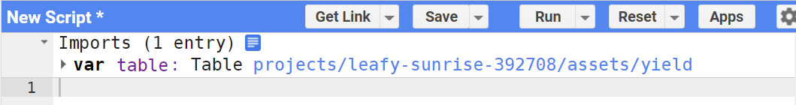

---

### *Shapefile*

导入`shp`文件，需要连同着`cpg,dbf,prj,shp,shx`文件一起导入。

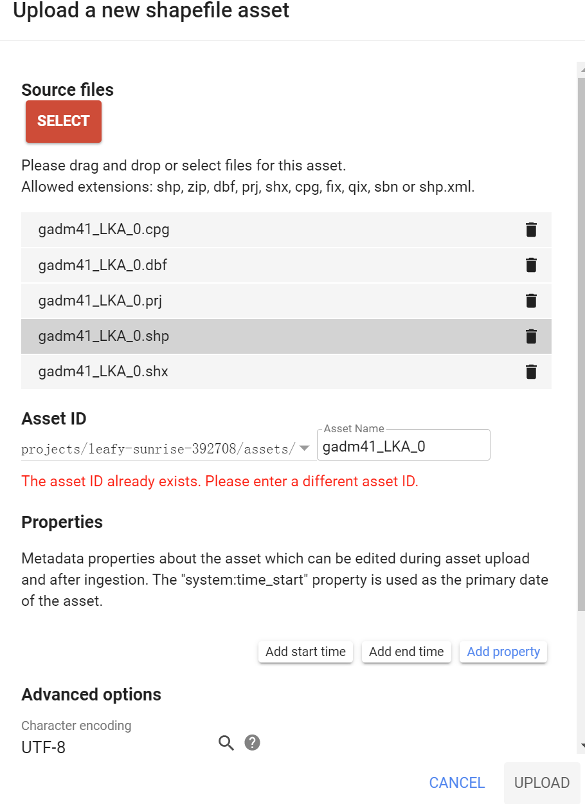

也可以直接导入整个`zip`文件，服务器会自动解包。

---

### *影像*

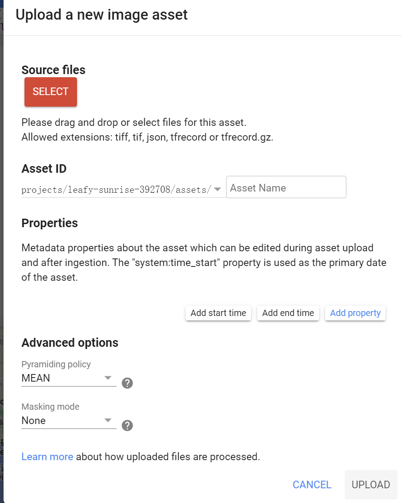

也差不多，高级选项里的金字塔策略，是关于如何创建较低分辨率版本的图像的，可以选择平均值、最大最小值等。

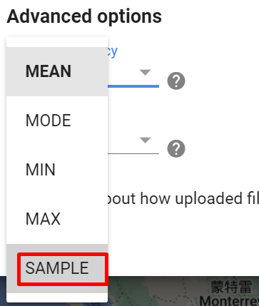

`SAMPLE`和`MODE`一般用于分类数据(土地覆盖数据)或质量保证数据。(SAMPLE是左上角第一个像素)

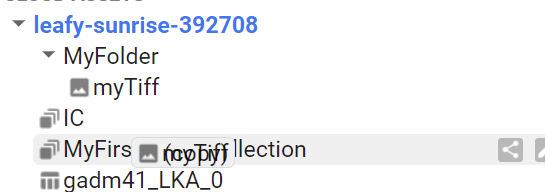

可以通过拖动的方式，将`Image`拖动到`ImageCollection`或是将其他文件拖动到文件夹下。

值得注意的是，如果你想在代码里导入shp，应该使用`ee.FeatureCollection`接口。

---

## 资源分享

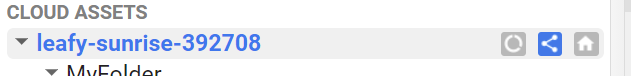

选择share project即可。

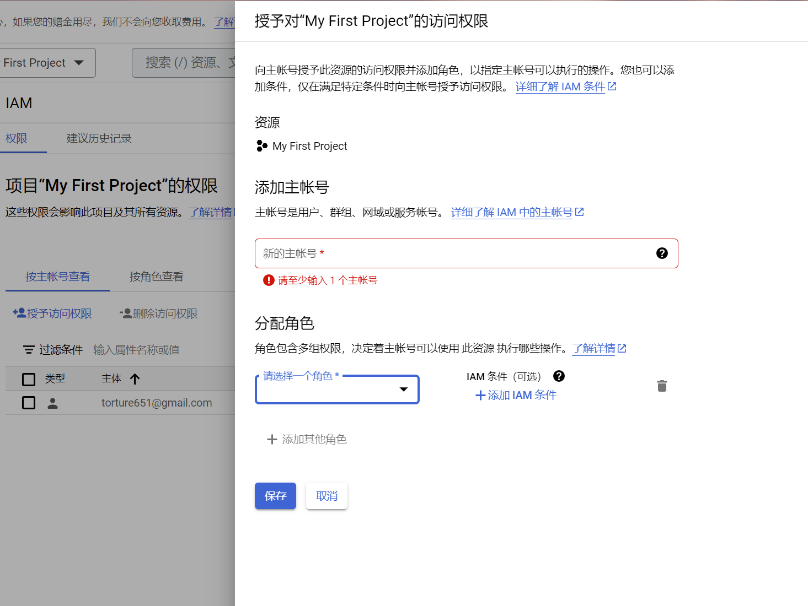

如果提供了写入权限，那么对方是可以将原始文件删除的，切记。

