## 1. Google在线代码编辑器

> Code Editor是GEE JavaScript API的网络集成开发环境，也就是我们编写JS程序的地方

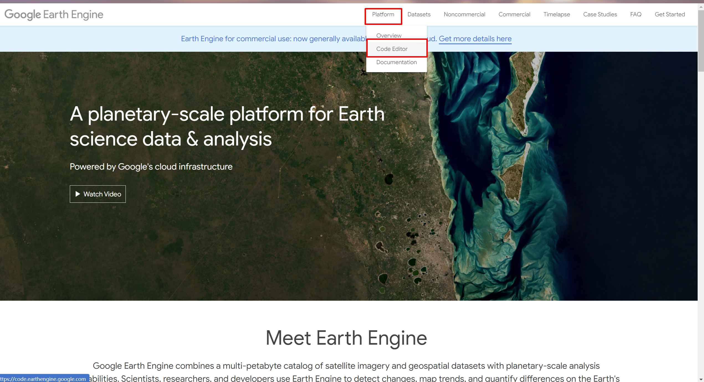

打开Google Earth Engine，点击`Platform->Code Editor`选项卡，进入代码编辑器。


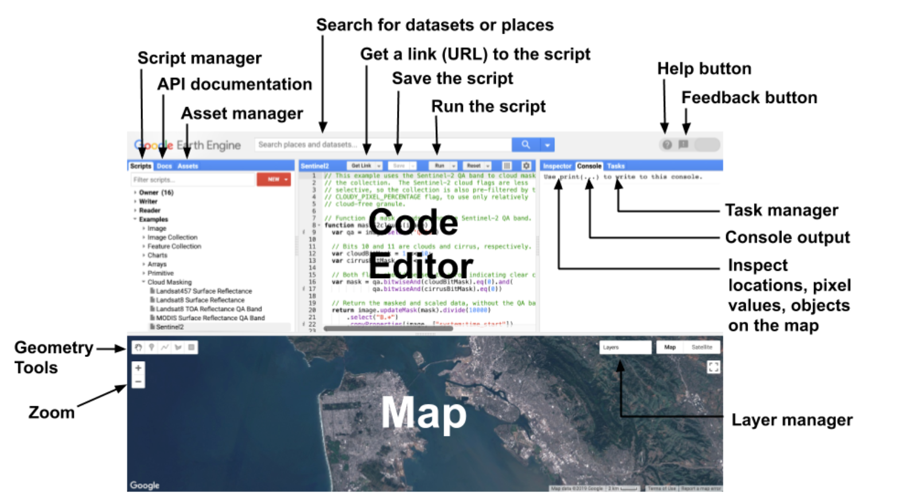

在左侧，我们可以看到`Docs`选项卡，该选项卡提供了所有方法的帮助文档。

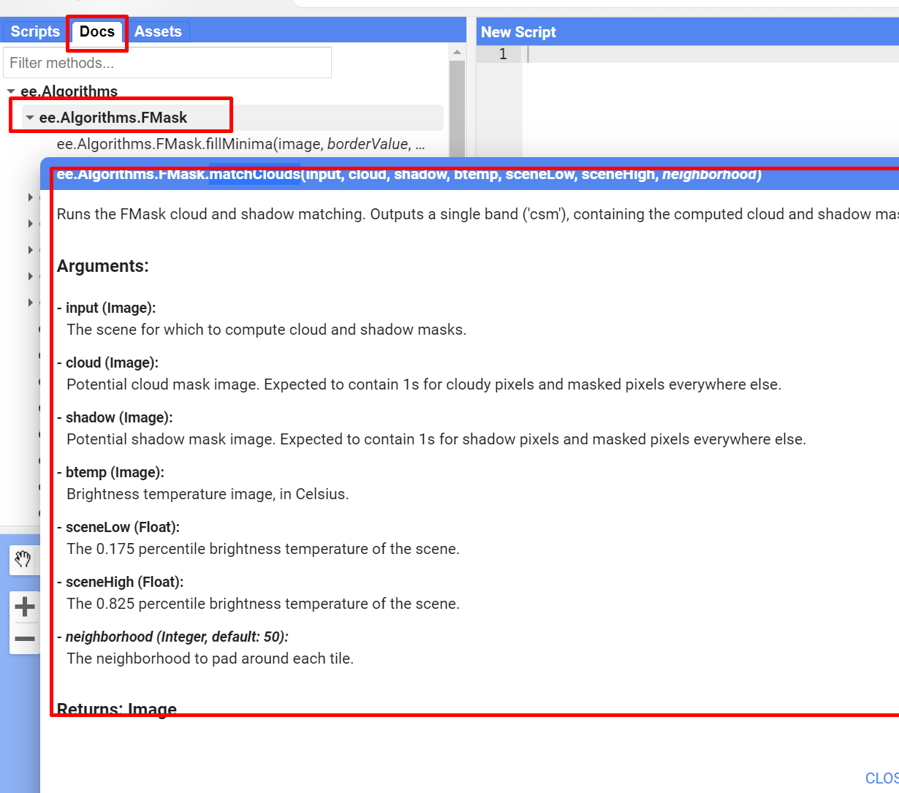

`Scripts`是google托管的git仓库：

通过`New`按钮，可以创建自己的文档。

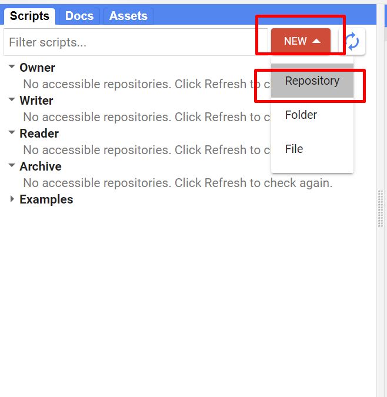

`Assets`选项卡允许你上传自己的文件。


在中间窗体，`Get Link`功能可以获取脚本的统一资源定位符，方便代码的共享。

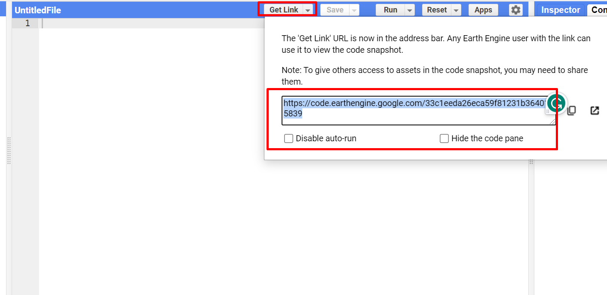

中间窗体上方的搜索栏允许检索数据集，对于找到的数据集可以直接导入：

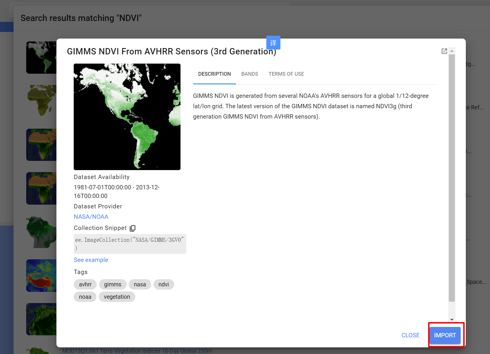

点击导入后的代码图标，即可获得导入生成代码。


在这里可以直接删除。


加载地图后，可以打开图层管理器，调整可视化参数等：


`inspector`选项卡根据鼠标点击位置获取地图信息，可以通过十字丝互动的方式检查地图中的结果。


`console`选项卡跟浏览器里的`console`相同，用来处理JS输出和变量。

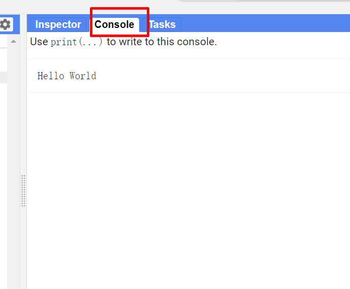

`Task`选项卡用来处理导入导出任务


`Profiler`选项卡会显示特定算法和计算所消耗的资源，如时间、CPU、内存等，可以通过按住`Ctrl+Alt+Enter`打开。


几何工具可以在地图上绘制几何图形。


可以选择添加新图层进行绘制。

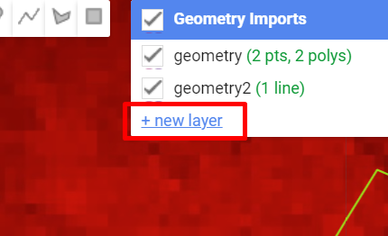

---

## 2. EE数据结构

在EE中，最基本的两种地理数据结构是`Image`和`Feature`，分别对应栅格和矢量数据。在这之上，还有`ImageCollection`和`FeatureCollection`对应栅格数据集与矢量数据集。

`Image`:star: 数据由波段和属性字典构成：

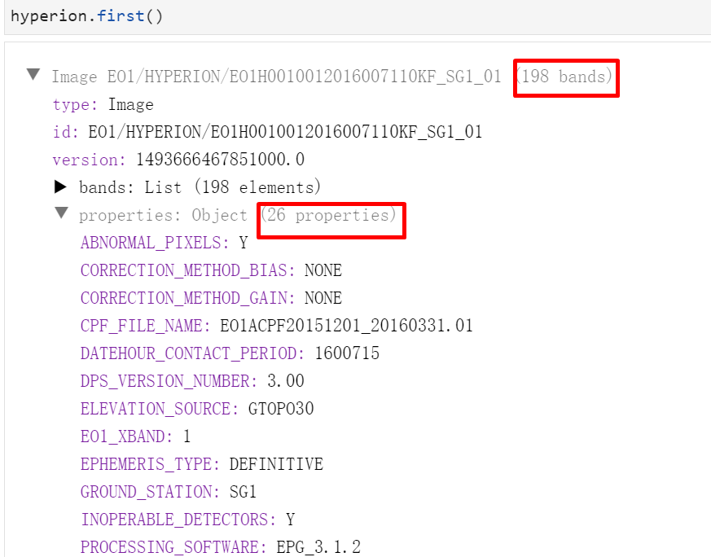

`Feature`:star2: 则是由`Geometry`对象和属性字典构成。


其他的对象还有`Dictionary`,`List`,`Array`,`Date`,`Number`,`String`等。

---

## 3. 数据搜索

如果我们想导入数据集，那么可以在搜索栏上直接检索我们所需要的数据：

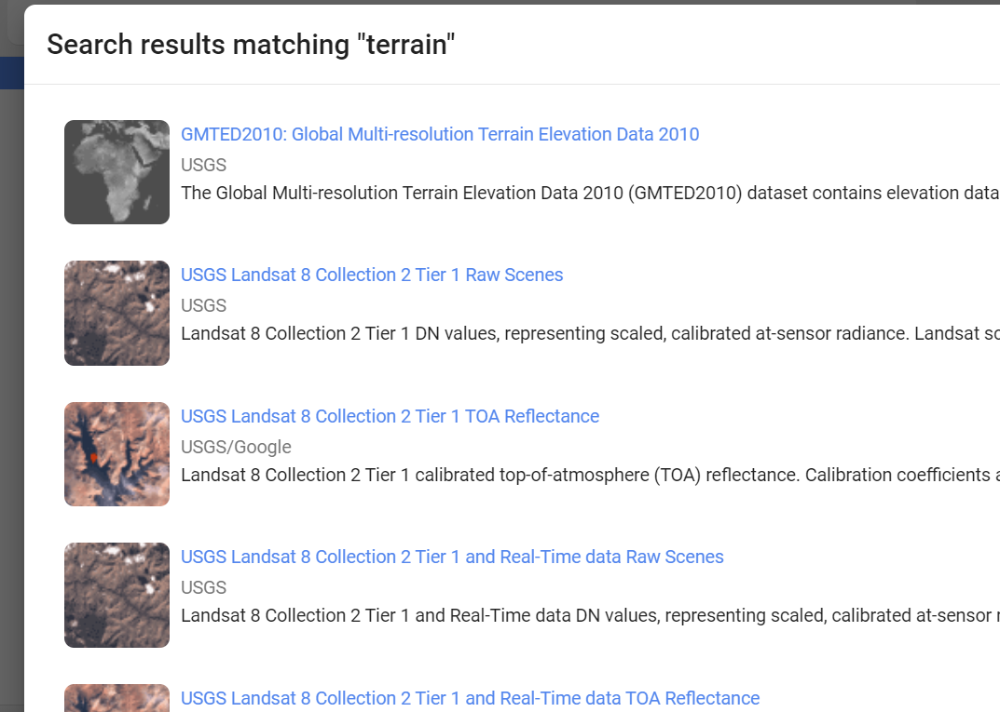

或者是在Earth Engine Data Catalog中检索:


---

## 4. 导入数据

导入数据相对简单，我们只需要知道所有的数据都将被存放在`Map`对象的`Layer`容器中。例如：

```js
// 从档案中选择数据
var image = ee.Image('LANDSAT/LC08/C02/T1_TOA/LC08_044034_20140318');

// 定义数据的可视化参数
var vizParams = {bands: ['B5', 'B4', 'B3'], min: 0.02, max: 0.4, gamma: 1.3};

// 设置地图中心和初始缩放等级
Map.centerObject(image, 9);

// 添加地图，可视化配置，图层名
Map.addLayer(image, vizParams, 'Landsat 8 false color');
```

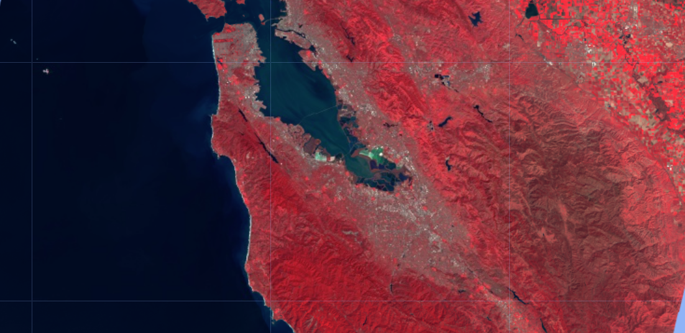

对于矢量要素的导入也是如此。

```js
var counties = ee.FeatureCollection('TIGER/2018/Counties');
Map.addLayer(counties, {}, 'counties');
```

## 5. 数据处理

### 5.1 过滤与排序

> GEE 提供了多种数据筛选的接口，包括按照空间、时间、属性等进行选取

为了限制结果的数量，通常有必要按空间或时间对集合进行过滤。

例如，我们想选取Landsat 8在旧金山市的无云影像图，可以进行如下操作：

+ 创建地理定位点，定位可以通过`Inspector`选项卡来获取

  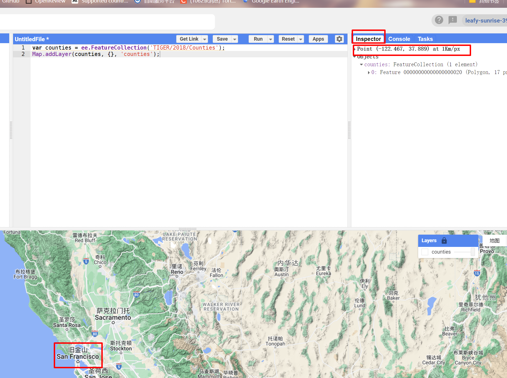

  ```js
  var point=ee.Geometry.Point(-122.467,37.889);
  ```

+ 选择需要的时间段

  ```js
  var s=ee.Date('2014-06-01');
  var e=ee.Date('2014-10-01');
  ```

+ 导入数据，并通过`Filter`方法进行处理，这里通过`sort`方法对云量属性进行降序排序

  ```js
  var fc=ee.ImageCollection("LANDSAT/LC08/C02/T1_TOA")
  	.filterBounds(point) // 通过空间Geometry选取
  	.filterDate(s,e) // 通过起止时间选取
  	.sort("CLOUD_COVER",true); // 按照属性排序，后面那个true表示降序
  ```

+ 选择云量最多的：

  ```js
  var fir=fc.first();
  ```

  看看效果？

  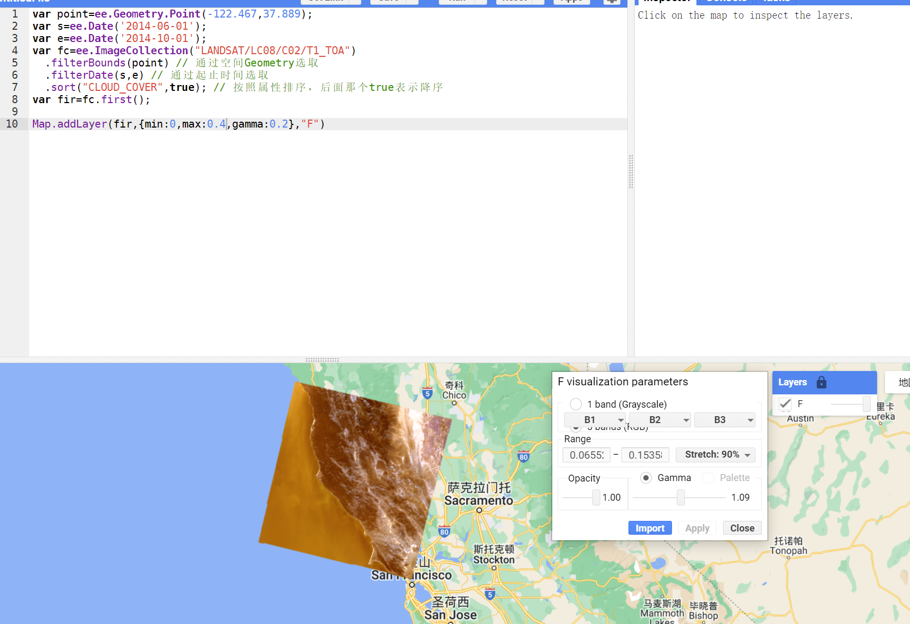

  **进阶用法**

  采用`filter()`和`ee.Filter`方法进行。

  ```js
  // 添加要素集
  var featureCollection = ee.FeatureCollection('TIGER/2016/States');
  
  // 过滤对象
  var filteredFC = featureCollection.filter(ee.Filter.eq('NAME', 'California'));
  
  // 显示
  Map.setCenter(-119.604, 37.798, 6);
  Map.addLayer(filteredFC, {}, 'California');
  ```

  ---

### 5.2 波段运算

就是跟`ArcGIS`里面的栅格计算器一样，本质上就是一些矩阵做元素位上的数字运算。

举个简单的栗子，计算`NDVI`

```js
// normalizedDifference方法是封装在EE中的NDVI计算方法
var getNDVI = function(image) {
  return image.normalizedDifference(['B4', 'B3']);
};

// 载入两个影像
var image1 = ee.Image('LANDSAT/LT05/C02/T1_TOA/LT05_044034_19900604');
var image2 = ee.Image('LANDSAT/LT05/C02/T1_TOA/LT05_044034_20100611');

// 从不同景影像里计算NDVI
var ndvi1 = getNDVI(image1);
var ndvi2 = getNDVI(image2);

// 计算NDVI差值
var ndviDifference = ndvi2.subtract(ndvi1);
```

如果不用系统定义的NDVI方法，我们也可以自己写一个。

```js
var getNDVI=function(img){
    var B4=img.select('B4');
    var B3=img.select('B3');
    return B4.subtract(B3).divide(B4.add(B3));
};
```

---

### 5.3 Mapping方法

`map()`方法可以逐个遍历元素并对元素按照回调函数接口的内容进行过处理，它可以在`ImageCollection`,`FeatureCollection`或是`List`对象上使用。下面举个简单的栗子：

```js
var addNDVI=function(image){
    return image.addBands(image.normalizedDifference(['B5','B4']));
};

var collection=ee.ImageCollection("LANDSAT/LC08/C02/T1_TOA")
	.filterBounds(ee.Geometry.Point(-122.262,37.8719))
	.filterDate('2014-06-01','2014-10-01');

// 对Collection容器内的每张图片都应用定义好的方法
var ndviCollection=collection.map(addNDVI);
```

> map() 方法可以快速完成迭代遍历的工作，是十分有效的方法

下一个栗子是为`FeatureCollection`添加属性，在本例子中，新的属性将会由两个已有的属性生成：

```js
var addField=function(feature){
    // 为了使用add方法，需要将属性转为ee.Number对象
    var sum=ee.Number(feature.get('property1')).add(feature.get('property2'));
    return feature.set({'sum':sum});
}
// 在JS中，获取要素对象的属性用的是`get(字符串名)`方法，设置属性则用的是`set(字典)`方法

// 创建一个要素容器对象
var features=ee.FeatureCollection([
    ee.Feature(ee.Geometry.Point(-122.4536,37.7403),{property1:100,property2:100}),
    ee.Feature(ee.Geometry.Point(-118.2294,34.039),{property1:200,property2:300})
]);

// 应用map方法
var featureCollection=features.map(addField);
print(featureCollection.first().get("sum"));
print(featureCollection);
```

除却对属性数值进行操作，`map`也可以直接对对象进行操作：

```js
var getGeom=function(image){
    return ee.Feature(image.geometry().centroid(),{foo:1});
};

var collection=ee.ImageCollection("LANDSAT/LC08/C02/T1_TOA")
	.filterBounds(ee.Geometry.Point(-122.262,37.8719))
	.filterDate('2014-06-01','2014-10-01')

var featureCollection=ee.FeatureCollection(collection.map(getGeom));

print(featureCollection);
```

<span style="color:#007947">总结</span>

> map操作可以对可迭代对象的每个元素进行操作，其使用方法为：
>
> + collections.map(func);
>
> func的定义通常需要传入元素对象，返回一个元素对象：
>
> + function(image){return image};
>
> 最终map函数将自动将这些元素叠加起来，我们采用一个容器进行存放即可：
>
> + var C=collections.map(func);

---

### 5.4 Reducing方法

`Reducing`方法是将数据立方体压缩聚合的方法，之前多见于数据仓库这类需要构建数据立方体的工程。在GEE中，`Reducing`方法可以沿着时间、空间、波段、`array`甚至是其他数据结构进行聚合，且提供了多种多样的`API`。

下面这个栗子将演示如何通过`Reducing`方法对Landsat8云量最低的五张图片的像素中值：

```js
var collection=ee.ImageCollection('LANDSAT/LC08/C02/T1_TOA')
	.fillterBounds(ee.Geometry.Point(-122,37))
	.filterDate('2014-01-01','2014-06-01')
	.sort('CLOUD_COVER',true);

var median=collection.limit(5).reduce(ee.Reducer.median());
```

`Reducing`也可以用于获取`Feature`或`FeatureCollection`定义的区域内部的统计量。

下面这个栗子将通过`reduceRegion`方法统计ROI内部像素的平均值：

```js
var img=ee.Image("LANDSAT/LC08/C02/T1_TOA/LC08_044034_20140318");
Map.addLayer(img,{bands:['B4',"B3","B2"],max:0.3});

// 创建一个几何区域
var region=ee.Geomerty.Rectangle(-122.2806,37.1209,-122.0545,37.2413);
Map.addLayer(region);

// 基于这个几何区域创建平均值字典
var mean=img.reduceRegion(
    {
        reducer:ee.Reducer.mean(),
        geometry:region,
        scale:30
    }
);
```

---

### 5.5 Masking方法

`Masking`方法提供了地理掩码，每个`Image`对象的每个像素实际上都有一个`Mask`值，用来做self卷积操作，或者说加权操作。这个值在[0,1]之间，当`Mask==0`，该像素将会被视为无数据。也就是操作不会对其生效。

我们现在来看一个案例，该案例将构建一个掩膜区域，所有的运算都将会掩膜区域内进行。

```js
var getNDVI=function(img){
    return img.normalizedDifference(['B4',"B3"]);
};

var image1 = ee.Image('LANDSAT/LT05/C02/T1_TOA/LT05_044034_19900604');
var image2 = ee.Image('LANDSAT/LT05/C02/T1_TOA/LT05_044034_20100611');

var ndvi1=getNDVI(image1);
var ndvi2=getNDVI(image2);
var niviDifference=ndvi1.substract(ndvi2);

// 创建一个掩膜区域，这个掩膜区域可以从别的影像上获取
var landMask=ee.Image('CGIAR/SRTM90_V4').mask();

// 更新Image对象的掩膜
var maskedDifference=ndviDifference.updateMask(landMask);

// 可视化结果
var viz={min:-0.5,max:0.5,palette;['FF0000','FFFFFF','0000FF']};
Map.setCenter(-122.2531,37.6295,9);
Map.addLayer(maskedDifference,viz,"NDVI difference");
```

`Masking`在运算中过滤数据也十分有效。下面这个栗子将计算不包括多云像素点的加利福尼亚州圣克拉拉县的季节平均NDVI值。

```js
// 添加NDVI函数
var addNDVI=function(image){
return image.addBands(image.normalizedDifference(["B5","B4"]));
};

// 添加多云像素掩膜
var cloudMask=function(image){
    var clouds=ee.Algorithms.Landsat.simpleCloudScore(image).select(['cloud']);
    return image.updateMask(clouds.lt(10));
}

// 加载数据
var collection = ee.ImageCollection('LANDSAT/LC08/C02/T1_TOA')
  .filterBounds(ee.Geometry.Point([-122.262, 37.8719]))
  .filterDate('2014-03-01', '2014-05-31')
  .map(addNDVI)
  .map(cloudMask);

// 对像素调用reduce方法进行聚合
var meanImage=collection.reduce(ee.Reducer.mean());
var viz={bands:['B5_mean'],['B4_mean'],['B3_mean'],min:0.02,max:0.4};
Map.addLayer(meanImage,viz,'mean');

// 加载区域并根据该区域进行运算
var c=ee.FeatureCollection("TIGER/2018/Countries");
var sc=ee.Feature(c.filter(ee.Filter.eq("NAME","Santa Clara")).first());
Map.addLayer(sc);

// 获取该区域的NDVI值
var mean=meanImage.select(['nd_mean']).reduceRegion({
    reducer:ee.Reducer.mean(),
    geometry:sc.geometry(),
    scale:30
});

mean.get("nd_mean").evaluate(function(val){print("Santa Clara spring mean NDVI :",val);});
```


