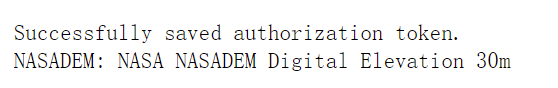

# Python API安装

---

**conda**

+ ```python
  conda update -c conda-forge earthengine-api
  ```

**pip**

+ ```python
  pip install earthengine-api --upgrade
  ```

装好了之后，我们就可以尝试导入了。

注意的是，一定需要先授权和初始化：

```js
import ee
ee.Authenticate()
ee.Initialize()
print(ee.Image("NASA/NASADEM_HGT/001").get("title").getInfo())
```


完成账号登录和授权后，就可以拿到tokens了。


当我们完成授权后，就可以正常的在本地环境使用API了。




---

> 在官方文档中，给出了几个使用示例。

### *日期对象*

如果要在客户端使用并管理日期对象，我们需要用到`datetime`模块。

```js
import datetime
```

将`ee.Date`转为客户端数据:

```js
ee_date=ee.Date('2020-01-01')
py_date=datetime.datetime.utcfromtimestamp(ee_date.getInfo()['value']/1000.0)
```

将客户端数据转化为`ee.Date`对象

```js
py_date=datetime.datetime.utcnow()
ee_date=ee.Date(py_date)
```

---

### *导出数据*

使用Python API导出数据需要使用`ee.batch`模块，该模块提供了导出函数的接口，导出任务必须通过调用已定义任务的`start()`方法来启动，通过调用`status()`方法查询任务的状态。

```js
task=ee.batch.Export.image.toDrive(
    image=my_image,
    region=my_geometry,
    folder='gdrive_folder',
    fileNamePrefix='mock_export',
    scale=1000,
    crs='EPSG:4326'
)
```

定了了任务之后，需要调用`start()`方法执行。

```js
task.start()

# 查看任务状态
task.status()
```
完整流程如下：
```js
landsat=ee.Image("LANDSAT/LC08/C02/T1_TOA/LC08_123032_20140515").select(['B4','B3','B2'])
geo=ee.Geometry.Rectangle([116.2621,39.8412,116.4849,40.01236])

pro=landsat.select('B2').projection().getInfo()


task=ee.batch.Export.image.toDrive(
    image=landsat,
    region=geo,
    folder='gdrive_folder', # google drive的文件夹
    fileNamePrefix='mock_export', # 导出的文件名
    crs=pro['crs'], # 注意的是Python不能用字典.属性来获取值，但是Js可以
    scale=30
)

task.start()
```
不出意外的话，我们可以在云端看到：


---

### *打印信息*

可以通过`getInfo()`方法查看元数据信息。

```js
img = ee.Image('LANDSAT/LT05/C01/T1_SR/LT05_034033_20000913')

# Print image object WITHOUT call to getInfo(); prints serialized request instructions.
print(img)

# Print image object WITH call to getInfo(); prints image metadata.
print(img.getInfo())
```

---

### *美化输出*

可以用`pprint.pprint`代替`print`方法进行输出