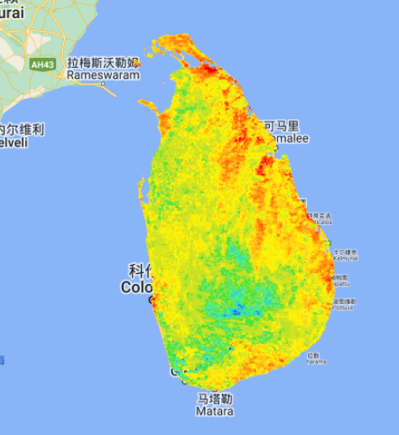

> 任务要求：根据斯里兰卡的矢量shp对地表温度数据进行裁剪，并导出数据

思路：

+ 获取原始栅格、矢量数据
+ 对数据集进行合并，后进行裁剪
+ 导出到Drive硬盘中

```js
// 这段代码是按行政区划裁剪并导出栅格图的模板案例

// 栅格数据
var img=ee.ImageCollection("MODIS/061/MOD11A2")
    .filter(ee.Filter.date('2018-01-01','2018-05-01'));

// 矢量边界
var shp=ee.FeatureCollection("FAO/GAUL/2015/level0")
    .filter(ee.Filter.eq("ADM0_NAME","Sri Lanka"));

// 裁剪函数clipToCollection
// 这个函数只适用于image,对于ImageCollection需要用map迭代
function clipFunction(img){
    return img.clipToCollection(shp);
}

var img=img.map(clipFunction);
var img=img.select('LST_Day_1km');

// 配置可视化参数，这个一般数据集会给出
var landSurfaceTemperatureVis = {
    min: 14000.0,
    max: 16000.0,
    palette: [
      '040274', '040281', '0502a3', '0502b8', '0502ce', '0502e6',
      '0602ff', '235cb1', '307ef3', '269db1', '30c8e2', '32d3ef',
      '3be285', '3ff38f', '86e26f', '3ae237', 'b5e22e', 'd6e21f',
      'fff705', 'ffd611', 'ffb613', 'ff8b13', 'ff6e08', 'ff500d',
      'ff0000', 'de0101', 'c21301', 'a71001', '911003'
    ],
  };

Map.setCenter(80.738, 7.51);
Map.addLayer(img, landSurfaceTemperatureVis,'Land Surface Temperature');

```



此时存在几个问题：

+ 无法获取图层的投影
+ 无法导出

这是因为图层是由不同底图拼接起来的，在做裁剪之前，应该对其先做镶嵌工作：

```js
// 这段代码是按行政区划裁剪并导出栅格图的模板案例

// 矢量边界
var shp=ee.FeatureCollection("FAO/GAUL/2015/level0")
    .filter(ee.Filter.eq("ADM0_NAME","Sri Lanka"));

// 栅格数据
var img=ee.ImageCollection("MODIS/061/MOD11A2")
    .filter(ee.Filter.date('2018-01-01','2018-05-01'))
    .filterBounds(shp).select('LST_Day_1km')
    .mosaic().clip(shp)
    
// 获取投影
var pro=img.projection().getInfo();

// 配置可视化参数，这个一般数据集会给出
var landSurfaceTemperatureVis = {
    min: 14000.0,
    max: 16000.0,
    palette: [
      '040274', '040281', '0502a3', '0502b8', '0502ce', '0502e6',
      '0602ff', '235cb1', '307ef3', '269db1', '30c8e2', '32d3ef',
      '3be285', '3ff38f', '86e26f', '3ae237', 'b5e22e', 'd6e21f',
      'fff705', 'ffd611', 'ffb613', 'ff8b13', 'ff6e08', 'ff500d',
      'ff0000', 'de0101', 'c21301', 'a71001', '911003'
    ],
  };

Map.setCenter(80.738, 7.51);
Map.addLayer(img, landSurfaceTemperatureVis,'Land Surface Temperature');

/* -----------------------------------------------------------------------------------------------*/
// 获取边界信息
var geo=shp.geometry();

// 导出任务配置
Export.image.toDrive({
    image:img,
    description:"landSurface Temperature",
    region:geo,
    crs:pro.crs,
    crsTransform:pro.transform
});
```

此时，任务已经成功执行啦


